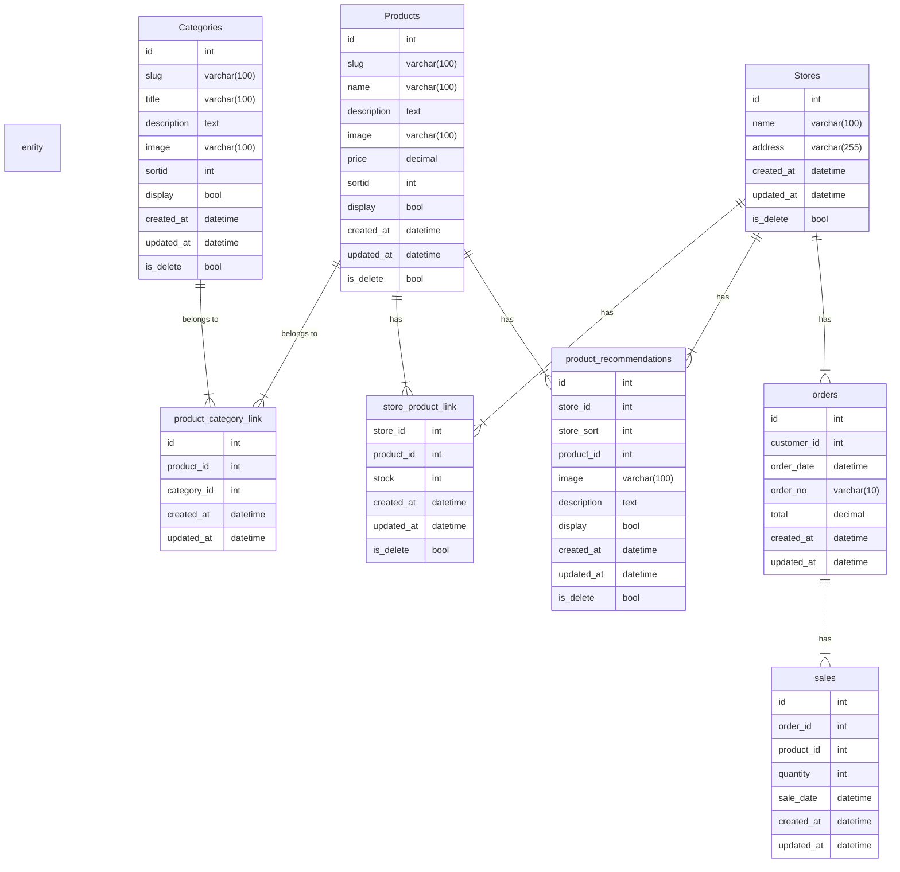

# ER 図

## テーブル定義

```sql
--
-- 商品テーブル
--
create table Products (
	id int not null,
	slug varchar(100),	-- 商品タグ名(英字)
	name varchar(100),	-- 商品名
	description text,	-- 商品説明
	image varchar(100),	-- 商品写真URL
	price decimal(10,2), -- 価格
	sortid int,			-- ソートID
	display bool,		-- 表示有無
    created_at datetime,	-- 作成日時
    updated_at datetime,	-- 更新日時
    deleted_at datetime		-- 削除フラグ
);


--
-- カテゴリテーブル
--
create table Categories (
	id int not null,
	slug varchar(100),	-- カテゴリタグ(英字)
	title varchar(100),	-- カテゴリ名
	description text,	-- カテゴリ詳細説明
	image varchar(100),	-- カテゴリ画像URL
	sortid int,			-- ソートID
	display bool,		-- 表示有無
	created_at datetime,	-- 作成日時
	updated_at datetime,	-- 更新日時
    deleted_at datetime		-- 削除フラグ
);


-- 
-- 商品カテゴリの連携テーブル
--
CREATE TABLE product_category_link (
	id int not null,
    product_id int not null,	-- 商品ID
    category_id int not null,	-- カテゴリID
	created_at datetime,	-- 作成日時
	updated_at datetime	    -- 更新日時
);

--
-- 店舗テーブル
-- 
create table Stores ( 
	id int not null,		-- 店舗id
	name varchar(100),		-- 店舗名
	address varchar(255),	-- 店舗住所
	created_at datetime,	-- 作成日時
	updated_at datetime,	-- 更新日時
    deleted_at datetime		-- 削除フラグ
);

--
-- 店舗から商品への連携テーブル
--
create table store_product_link (
    store_id int not null,	    -- 店舗ID
    product_id int not null,	-- 商品ID
    stock int,				    -- 在庫数
    created_at datetime,	    -- 作成日時
    updated_at datetime,	    -- 更新日時
    deleted_at datetime		-- 削除フラグ
);


-- 
-- 商品のお薦めリスト
-- 
create table product_recommendations (		-- お薦めリスト
	id int not null,						-- ID
	store_id int not null,					-- 店舗id
	store_sort int,							-- 順序番号
	product_id int not null,				-- 商品ID
	image varchar(100),						-- お薦め写真
	description text,						-- お薦めの説明
	display	bool,							-- 表示有無
    created_at datetime,	    -- 作成日時
    updated_at datetime,	    -- 更新日時
    deleted_at datetime		-- 削除フラグ
);


--
-- 注文履歴テーブル
-- 
create table orders (		-- 注文履歴
	id int not null,		-- 注文id
	customer_id int not null,-- 顧客id
	order_date datetime,		-- 注文日時
	order_no	varchar(10),	-- 注文番号
	total decimal(10,2),		-- 合計金額
    created_at datetime,	    -- 作成日時
    updated_at datetime,	    -- 更新日時
);

--
-- 販売情報テーブル
--
create table sales (
	id int not null,
    order_id int not null       -- 注文id
	product_id int not null, 	-- 商品id
	quantity int, 				-- 販売数量
	sale_date datetime,			-- 販売日時
    created_at datetime,	    -- 作成日時
    updated_at datetime,	    -- 更新日時
);

-- 
-- 顧客テーブル
-- 
create table Customers (
	id int not null,
	name varchar(100),			-- 顧客id
	hash varchar(100),			-- 顧客名
	lastlogin datetime,			-- 最終ログイン
	created_at datetime,	-- 作成日時
	updated_at datetime,	-- 更新日時
    deleted_at datetime		-- 削除フラグ
);


```

## ER 図




